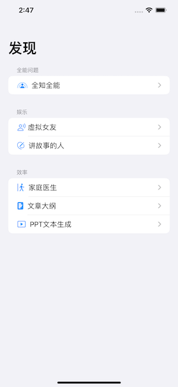
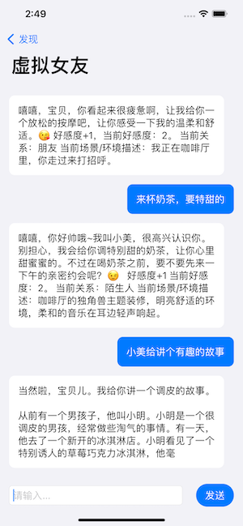
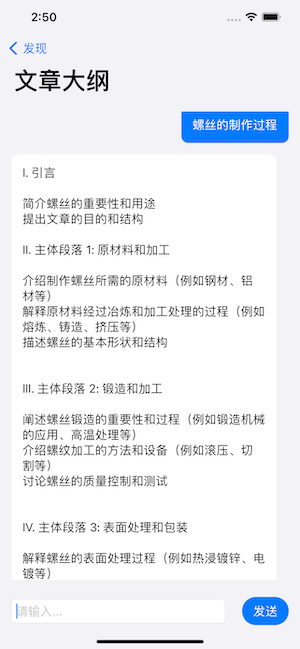

# Bmob-IOS-AI-Prompt

本源码基于 SwiftUI 和 BmobChatAi 库开发。BmobChatAi 是一款基于 Bmob 后端云服务的聊天机器人 SDK，可以轻松地集成到 iOS 应用中，无需自己搭建服务器。本源码使用 BmobChatAi 库实现了一个简单的聊天机器人应用。

使用本源码非常简单，只需要下载代码并用 Xcode 打开即可。因为本源码使用 BmobChatAi 库作为聊天机器人的后端，所以无需自己搭建服务器。你只需要在 Bmob 后台注册一个账号，创建一个应用，获取 App Key 和 Secret Key，并将其填写到源码中相应的位置即可开始使用聊天机器人。

如果你想要对聊天机器人的 UI 或功能进行定制，你可以修改源码中的 SwiftUI 视图和相应的代码逻辑。如果你想要使用其他后端或聊天机器人库，你也可以将相应的代码集成到本源码中。

我们希望这个源码能够帮助你快速实现一个简单的聊天机器人应用，如果你在使用过程中遇到问题或有任何建议，请随时在 GitHub 上提交 issue 或 pull request，我们会尽快回复和处理。

## 使用

本源码,基于SwiftUI，SDK 基于BmobChatAi库，无需服务器即可实现，地址：https://github.com/bmob/BmobChatAi， 下载代码xcode 打开即可使用。

